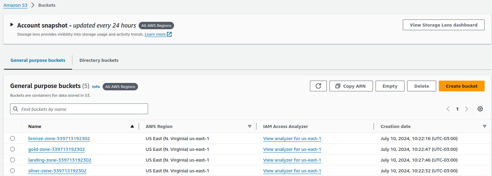
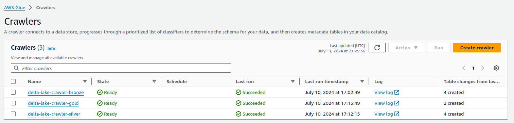
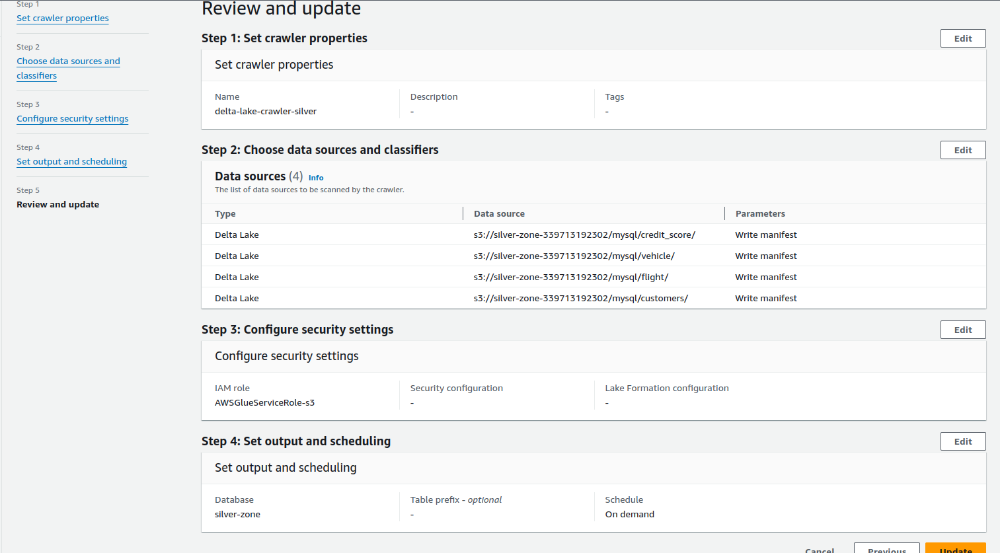
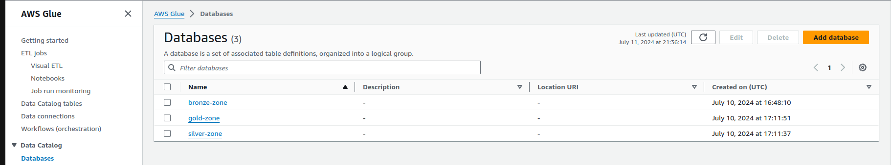
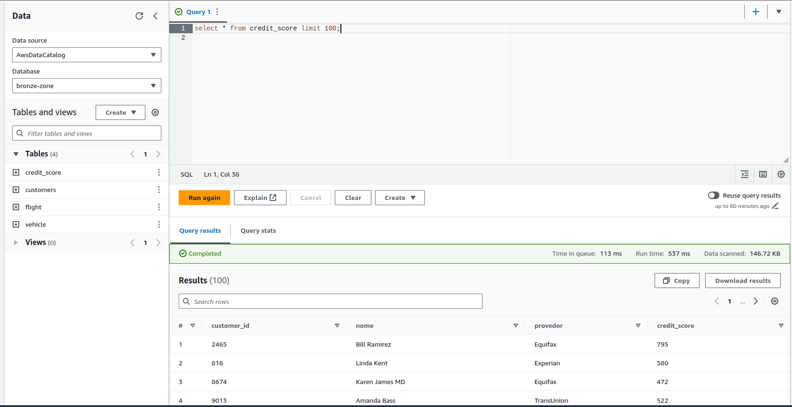
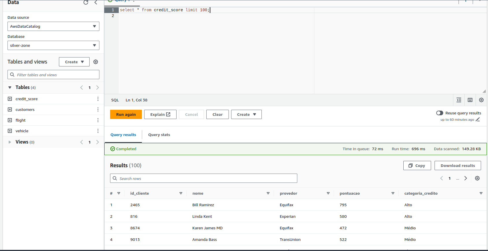
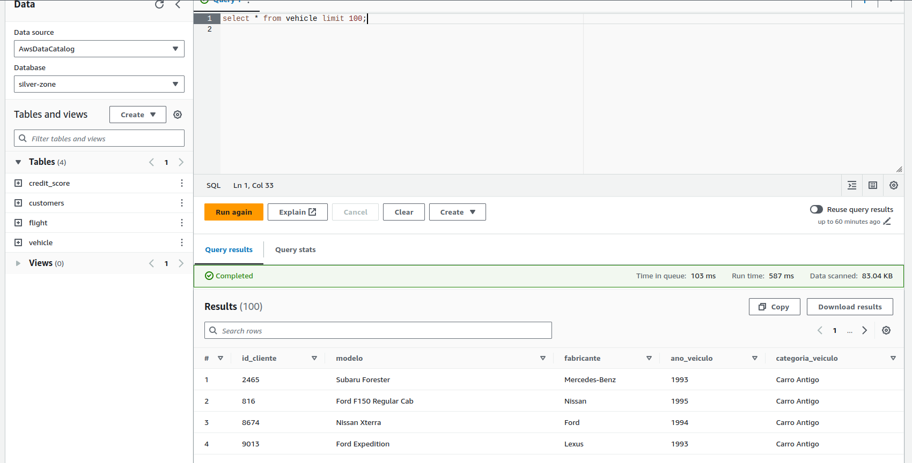
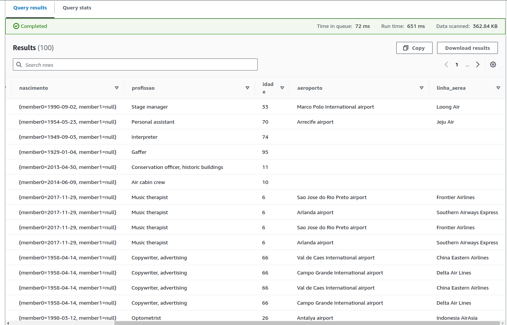

# Documentação da Arquitetura

## Descrição da Arquitetura

Este projeto tem como objetivo criar uma arquitetura de processamento de dados usando serviços da AWS e ferramentas de processamento de dados. A arquitetura foi configurada para estudo e demonstração dos seguintes serviços e processos:

1. **Terraform**: Utilizado para provisionar a infraestrutura.
2. **AWS Lambda**: Função para popular dados no Amazon RDS MySQL.
3. **Amazon RDS MySQL**: Banco de dados relacional para armazenamento de dados.
4. **EC2**: Instância para execução do Airbyte.
5. **Airbyte**: Ferramenta de integração de dados para ingerir dados do MySQL para o Amazon S3 no formato Parquet.
6. **Amazon S3**: Armazenamento de dados em buckets com dados organizados nas camadas Bronze, Silver e Gold.
7. **PySpark**: Processamento de dados no formato Parquet e criação das camadas Bronze, Silver e Gold com o Delta Lake.
8. **AWS Glue**: Catalogação dos dados no Glue Data Catalog.
9. **AWS Athena**: Consulta e exploração dos dados catalogados.
10. **IAM Roles**: Gerenciamento de permissões e segurança de acesso aos serviços.
11. **CloudWatch e Slack**: Monitoramento de erros e atividades na arquitetura.

## Detalhes da Arquitetura

### Provisionamento da Infraestrutura

Utilizei o Terraform para criar e configurar os seguintes recursos:

- **VPC**: Rede Virtual Privada para isolar a infraestrutura.
- **Subnets**: Sub-redes para segmentar o tráfego e melhorar a segurança.
- **Amazon RDS MySQL**: Instância de banco de dados relacional para armazenar os dados iniciais.

**Nota:** O cluster EMR foi provisionado manualmente pelo console da AWS. Os arquivos PySpark necessários para processamento no EMR estão incluídos neste repositório.

### Processamento de Dados

1. **AWS Lambda**:
   - Função Lambda criada para popular o Amazon RDS MySQL com dados, utilizando a biblioteca faker do python para isso.

2. **EC2 e Airbyte**:
   - Instância EC2 provisionada e configurada com o Airbyte.
   - Airbyte realiza a ingestão dos dados do MySQL para o Amazon S3, transformando-os para o formato Parquet.

3. **PySpark e Delta Lake**:
   - Código PySpark desenvolvido para processar dados no formato Parquet e carregá-los nas camadas Bronze, Silver e Gold no Amazon S3.
   - **Delta Lake**: Utilizado para gerenciar e otimizar o armazenamento e processamento de dados.

   **Benefícios do Delta Lake**:
   - **ACID Transactions**: Garante transações atômicas, consistentes, isoladas e duráveis, evitando problemas comuns de leitura e gravação de dados.
   - **Schema Evolution**: Permite alterações no esquema de dados sem a necessidade de recriar tabelas ou reprocessar os dados existentes.
   - **Time Travel**: Possibilita acessar dados históricos e realizar auditoria de alterações, facilitando a recuperação de versões anteriores dos dados.

4. **AWS Glue**:
   - Glue Crawler utilizado para catalogar os dados e criar tabelas no Glue Data Catalog.
   - Cada camada (Bronze, Silver, Gold) é representada por uma tabela correspondente.

5. **AWS Athena**:
   - Utilizado para explorar e consultar os dados catalogados no Glue Data Catalog.

### Monitoramento e Segurança

- **IAM Roles**: Configurados para gerenciar permissões e garantir segurança de acesso.
- **CloudWatch**: Monitoramento e logging das atividades na arquitetura.
- **Slack**: Notificações de erros e alertas de falhas utilizando integração com o CloudWatch.

## Instruções para Execução

1. **Provisionar Infraestrutura**:
   - Execute `terraform apply` para criar os recursos conforme listado acima.

2. **Configurar Airbyte**:
   - Inicie a instância EC2 e configure o Airbyte para realizar a ingestão dos dados na landing-zone.

3. **Executar Processamento de Dados**:
   - Utilize o PySpark para processar dados e carregá-los nas camadas Bronze, Silver e Gold.

4. **Catalogar e Explorar Dados**:
   - Configure o Glue Crawler e utilize o AWS Athena para explorar os dados.

5. **Monitoramento e Notificações**:
   - Verifique logs e configure notificações no CloudWatch e Slack.

## Conclusão

Esta arquitetura demonstra o uso integrado de várias ferramentas e serviços da AWS para criar uma solução robusta para processamento e análise de dados. A configuração e o fluxo de dados foram projetados para proporcionar um entendimento prático dos serviços e suas interações. O Delta Lake adiciona uma camada de gerenciamento avançado de dados, garantindo maior confiabilidade e flexibilidade no processamento e análise de grandes volumes de dados.

## Camadas no S3:

## Crawlers:

## Configurações crawler com fonte do tipo delta:

## Databases do data catalog:

## Camada bronze dados brutos no athena:

## Dados refinados na camada silver:

## Dados agregados na gold com base em regras de negócios:

## continuação:

